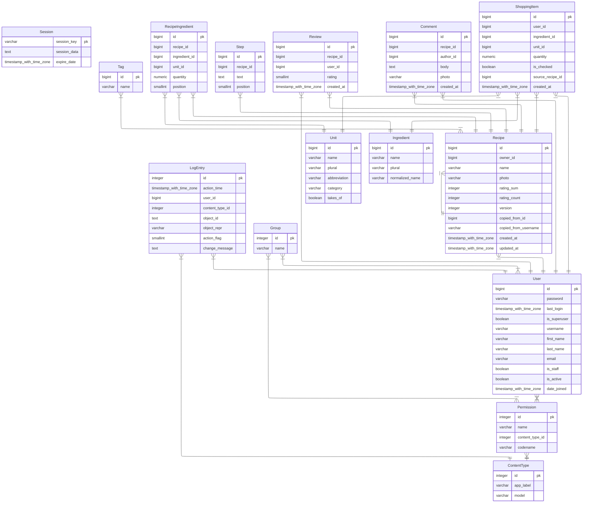

# Summary

The application is composed of two parts, the backend in Django and the frontend in React. Deployment is via `docker compose up`.

# Backend

The backend is plain Django views returning `JsonResponse` instead of using a framework like [Django REST Framework (DRF)](https://www.django-rest-framework.org/). The API is fairly small, and using the machinery that DRF provides would have made development more complicated rather than simpler. In addition, a guiding goal throughout the project has been to use the minimum amount of dependencies necessary.

The Python dependencies used in production are:

- Django, which is used for all APIs
- Pillow, for validating images
- psycopg, for accessing a Postgres DB

For development a few more dependencies are added:

- pytest and pytest-django, for automated testing
- mypy and django-stubs, for type checking
- ruff, for code formatting
- django-erd-generator, for generating an entity-relationship diagram and a data dictionary; while these could both be created by hand, generating them has the advantage of always keeping the diagrams up-to-date

The Django project consists of two apps and the `api` package.

## The `accounts` app

Owns the `User` model and its admin registration. A small custom `User` model was created for ease of future extension; for example, allowing users to log in via email instead of by username.

## The `recipes` app

Owns the `Recipe` model, its admin registration, a fixture for the demo website, and a seed management command for seeding the demo. The fixture provides data for the `Unit`, `Tag`, and `Ingredient` models which are necessary for both the bulk demo and the standard demo to run.

## The `api` package

Provides the HTTP JSON API that translates between Django models and HTTP request/response payloads. The frontend only communicates with the HTTP API, and has no knowledge of Django (the frontend runs on an entirely different container).

## Entity-relationship diagram

## Data Dictionary

Commit `7cd1651364a18d105360fc4a6660dc92c0a2d8e0`

---

### Table of Contents [#](#toc)

- [Table of Contents](#toc)
- [Modules](#modules)
  - [accounts](#accounts)
    - [User](#User)
  - [recipes](#recipes)
    - [Unit](#Unit)
    - [Tag](#Tag)
    - [Ingredient](#Ingredient)
    - [Recipe](#Recipe)
    - [RecipeIngredient](#RecipeIngredient)
    - [Step](#Step)
    - [Review](#Review)
    - [Comment](#Comment)
    - [ShoppingItem](#ShoppingItem)

---

### Modules [#](#modules)

#### accounts

##### User[#](#User)

`User(id, password, last_login, is_superuser, username, first_name, last_name, email, is_staff, is_active, date_joined)`

Custom user model.

Empty today, but swapping Django's user model later requires a manual
migration dance, so it costs nothing now and a lot later.

| pk | field_name | data_type | related_model | description | nullable | unique | choices | max_length | db_index |
| --- | --- | --- | --- | --- | --- | --- | --- | --- | --- | 
| ✓ | id | `bigint` |  |  |  | ✓ |  |  |  |
|  | password | `varchar` |  |  |  |  |  | 128 |  |
|  | last_login | `timestamp with time zone` |  |  | ✓ |  |  |  |  |
|  | is_superuser | `boolean` |  | Designates that this user has all permissions without explicitly assigning them. |  |  |  |  |  |
|  | username | `varchar` |  | Required. 150 characters or fewer. Letters, digits and @/./+/-/_ only. |  | ✓ |  | 150 |  |
|  | first_name | `varchar` |  |  |  |  |  | 150 |  |
|  | last_name | `varchar` |  |  |  |  |  | 150 |  |
|  | email | `varchar` |  |  |  |  |  | 254 |  |
|  | is_staff | `boolean` |  | Designates whether the user can log into this admin site. |  |  |  |  |  |
|  | is_active | `boolean` |  | Designates whether this user should be treated as active. Unselect this instead of deleting accounts. |  |  |  |  |  |
|  | date_joined | `timestamp with time zone` |  |  |  |  |  |  |  |
#### recipes

##### Unit[#](#Unit)

`Unit(id, name, plural, abbreviation, category, takes_of)`

A measurement, e.g. pound / cup / whole.

`category` only groups the picker in the UI. Nothing converts between
units.

| pk | field_name | data_type | related_model | description | nullable | unique | choices | max_length | db_index |
| --- | --- | --- | --- | --- | --- | --- | --- | --- | --- | 
| ✓ | id | `bigint` |  |  |  | ✓ |  |  |  |
|  | name | `varchar` |  |  |  |  |  | 30 |  |
|  | plural | `varchar` |  |  |  |  |  | 30 |  |
|  | abbreviation | `varchar` |  |  |  |  |  | 10 |  |
|  | category | `varchar` |  |  |  |  |  | 10 |  |
|  | takes_of | `boolean` |  | True renders "2 pounds of beef", False renders "3 whole oranges". |  |  |  |  |  |

##### Tag[#](#Tag)

`Tag(id, name)`

Created by admins only, via the Django admin.

| pk | field_name | data_type | related_model | description | nullable | unique | choices | max_length | db_index |
| --- | --- | --- | --- | --- | --- | --- | --- | --- | --- | 
| ✓ | id | `bigint` |  |  |  |  |  |  |  |
|  | name | `varchar` |  |  |  |  |  | 30 |  |

##### Ingredient[#](#Ingredient)

`Ingredient(id, name, plural, normalized_name)`

| pk | field_name | data_type | related_model | description | nullable | unique | choices | max_length | db_index |
| --- | --- | --- | --- | --- | --- | --- | --- | --- | --- | 
| ✓ | id | `bigint` |  |  |  | ✓ |  |  |  |
|  | name | `varchar` |  |  |  |  |  | 100 |  |
|  | plural | `varchar` |  |  |  |  |  | 100 |  |
|  | normalized_name | `varchar` |  |  |  |  |  | 100 | ✓ |

##### Recipe[#](#Recipe)

`Recipe(id, owner, name, photo, rating_sum, rating_count, version, copied_from, copied_from_username, created_at, updated_at)`

| pk | field_name | data_type | related_model | description | nullable | unique | choices | max_length | db_index |
| --- | --- | --- | --- | --- | --- | --- | --- | --- | --- | 
| ✓ | id | `bigint` |  |  |  | ✓ |  |  |  |
|  | owner_id | `bigint` | [User](#User) |  |  |  |  |  | ✓ |
|  | name | `varchar` |  |  |  |  |  | 200 |  |
|  | photo | `varchar` |  |  | ✓ |  |  | 100 |  |
|  | rating_sum | `integer` |  |  |  |  |  |  |  |
|  | rating_count | `integer` |  |  |  |  |  |  |  |
|  | version | `integer` |  |  |  |  |  |  |  |
|  | copied_from_id | `bigint` | [Recipe](#Recipe) |  | ✓ |  |  |  | ✓ |
|  | copied_from_username | `varchar` |  |  |  |  |  | 150 |  |
|  | created_at | `timestamp with time zone` |  |  |  |  |  |  |  |
|  | updated_at | `timestamp with time zone` |  |  |  |  |  |  |  |

##### RecipeIngredient[#](#RecipeIngredient)

`RecipeIngredient(id, recipe, ingredient, unit, quantity, position)`

| pk | field_name | data_type | related_model | description | nullable | unique | choices | max_length | db_index |
| --- | --- | --- | --- | --- | --- | --- | --- | --- | --- | 
| ✓ | id | `bigint` |  |  |  |  |  |  |  |
|  | recipe_id | `bigint` | [Recipe](#Recipe) |  |  |  |  |  | ✓ |
|  | ingredient_id | `bigint` | [Ingredient](#Ingredient) |  |  |  |  |  | ✓ |
|  | unit_id | `bigint` | [Unit](#Unit) |  |  |  |  |  | ✓ |
|  | quantity | `numeric` |  |  |  |  |  |  |  |
|  | position | `smallint` |  |  |  |  |  |  |  |

##### Step[#](#Step)

`Step(id, recipe, text, position)`

| pk | field_name | data_type | related_model | description | nullable | unique | choices | max_length | db_index |
| --- | --- | --- | --- | --- | --- | --- | --- | --- | --- | 
| ✓ | id | `bigint` |  |  |  |  |  |  |  |
|  | recipe_id | `bigint` | [Recipe](#Recipe) |  |  |  |  |  | ✓ |
|  | text | `text` |  |  |  |  |  |  |  |
|  | position | `smallint` |  |  |  |  |  |  |  |

##### Review[#](#Review)

`Review(id, recipe, user, rating, created_at)`

| pk | field_name | data_type | related_model | description | nullable | unique | choices | max_length | db_index |
| --- | --- | --- | --- | --- | --- | --- | --- | --- | --- | 
| ✓ | id | `bigint` |  |  |  |  |  |  |  |
|  | recipe_id | `bigint` | [Recipe](#Recipe) |  |  |  |  |  | ✓ |
|  | user_id | `bigint` | [User](#User) |  |  |  |  |  | ✓ |
|  | rating | `smallint` |  |  |  |  |  |  |  |
|  | created_at | `timestamp with time zone` |  |  |  |  |  |  |  |

##### Comment[#](#Comment)

`Comment(id, recipe, author, body, photo, created_at)`

| pk | field_name | data_type | related_model | description | nullable | unique | choices | max_length | db_index |
| --- | --- | --- | --- | --- | --- | --- | --- | --- | --- | 
| ✓ | id | `bigint` |  |  |  |  |  |  |  |
|  | recipe_id | `bigint` | [Recipe](#Recipe) |  |  |  |  |  | ✓ |
|  | author_id | `bigint` | [User](#User) |  |  |  |  |  | ✓ |
|  | body | `text` |  |  |  |  |  | 3000 |  |
|  | photo | `varchar` |  |  | ✓ |  |  | 100 |  |
|  | created_at | `timestamp with time zone` |  |  |  |  |  |  |  |

##### ShoppingItem[#](#ShoppingItem)

`ShoppingItem(id, user, ingredient, unit, quantity, is_checked, source_recipe, created_at)`

| pk | field_name | data_type | related_model | description | nullable | unique | choices | max_length | db_index |
| --- | --- | --- | --- | --- | --- | --- | --- | --- | --- | 
| ✓ | id | `bigint` |  |  |  |  |  |  |  |
|  | user_id | `bigint` | [User](#User) |  |  |  |  |  | ✓ |
|  | ingredient_id | `bigint` | [Ingredient](#Ingredient) |  |  |  |  |  | ✓ |
|  | unit_id | `bigint` | [Unit](#Unit) |  |  |  |  |  | ✓ |
|  | quantity | `numeric` |  |  |  |  |  |  |  |
|  | is_checked | `boolean` |  |  |  |  |  |  |  |
|  | source_recipe_id | `bigint` | [Recipe](#Recipe) |  | ✓ |  |  |  | ✓ |
|  | created_at | `timestamp with time zone` |  |  |  |  |  |  |  |
